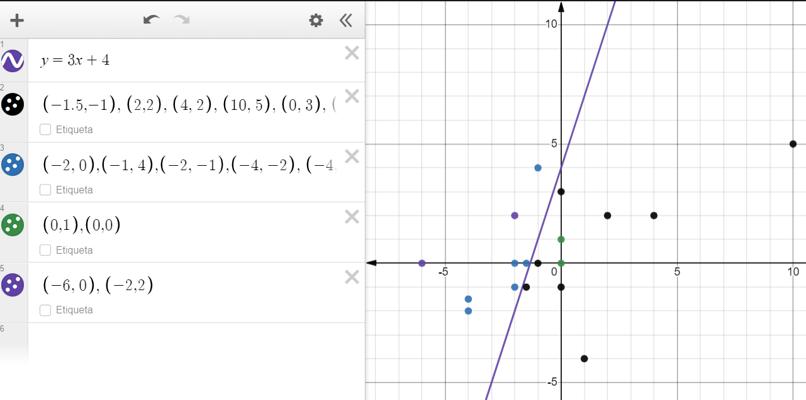

# Домашняя работа 2
Реализация алгоритма линейной регрессии как стандартного блока Spark ML.

# Данные для тестирования
Визуализацию данных для теста "Estimator should produce good predicts on test data" можно посмотреть ниже:

